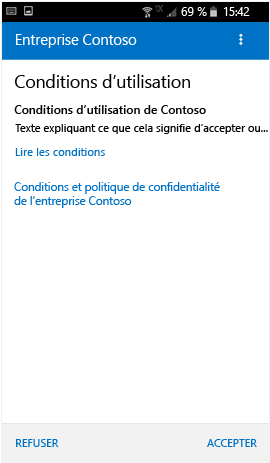
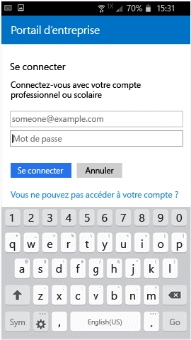
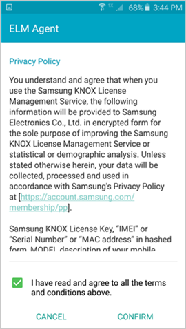
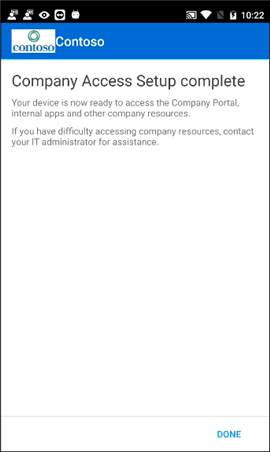

# Inscrire votre appareil Android avec le portail d’entreprise  
Inscrivez votre appareil Android personnel ou d’entreprise pour obtenir un accès sécurisé à l’e-mail, aux applications et aux données de l’entreprise. Le portail d’entreprise prend en charge les appareils Android, notamment Samsung Knox, exécutant Android 4.4 et ultérieur.  
 
> [!VIDEO https://www.youtube.com/embed/k0Q_sGLSx6o?rel=0]

> [!NOTE]
> Samsung Knox est un type de sécurité que certains appareils Samsung utilisent pour avoir une protection supplémentaire par rapport aux appareils Android natifs. Pour vérifier si vous avez un appareil Samsung Knox, accédez à **Paramètres** > **À propos de l’appareil**. Si **Version Knox** n’apparaît pas dans la liste, c’est que vous avez un appareil Android natif.

## Inscrire un appareil  
Veillez à [installez l’application Portail d’entreprise Intune gratuite à partir de Google Play](https://play.google.com/store/apps/details?id=com.microsoft.windowsintune.companyportal). 

Au cours de l’inscription, vous pouvez être invité à choisir une catégorie qui décrit le mieux votre utilisation de l’appareil. Le support technique de votre entreprise utilise votre réponse pour vérifier les applications auxquelles vous avez accès.  

1. Ouvrez l'application Portail d'entreprise.  

3. Dans l’écran de **bienvenue** du portail d’entreprise, appuyez sur **Se connecter**, puis connectez-vous avec votre compte professionnel ou scolaire.

      

4. Si vous êtes invité à accepter les termes et conditions de votre organisation, appuyez sur **ACCEPTER**. Cet écran peut être légèrement différent de l’exemple de capture d’écran ci-dessous. 

   

5. Connectez-vous à l’application Portail d’entreprise à l’aide de votre compte professionnel ou scolaire et de votre mot de passe, puis appuyez sur **Se connecter**.

   

6. Dans l’écran **Configuration de l’accès à l’entreprise**, appuyez sur **CONTINUER**.

   

   > [!NOTE]
   > Les triangles jaunes ne signifient pas que vous avez déjà rencontré une erreur. Ces icônes indiquent qu’il existe toujours des étapes à effectuer dans le processus d’inscription.

7. Consultez la liste de ce que le support technique de votre entreprise peut voir ou non sur votre appareil, puis appuyez sur **CONTINUER**.

   

8. Dans l’écran **Et ensuite ?** , découvrez ce qui se passe lors de l’inscription, puis appuyez sur **INSCRIRE**.

   

9. Si vous utilisez Android 6.0 ou version ultérieure, effectuez cette étape. Sinon, passez à l'étape suivante.

   Si le support technique de votre entreprise a configuré certaines stratégies, les messages suivants peuvent s’afficher :
   - **Autoriser l’application Portail d’entreprise à passer et gérer des appels téléphoniques ?**

     

   Si ce message s’affiche, appuyez sur **Autoriser** Vous pouvez appuyer sur AUTORISER sans risques car **Microsoft ne passe jamais ni ne gère vos appels téléphoniques**. Google contrôle le texte du message et Microsoft ne peut pas le modifier. Quand vous autorisez l’accès, vous permettez simplement à votre appareil d’envoyer son numéro d’identité internationale d’équipement mobile (IMEI) à Intune. Le numéro IMEI est comparable à un numéro de série qui identifie un appareil mobile de façon unique.

   Si vous refusez l’accès, le message s’affiche à nouveau la prochaine fois que vous vous connectez au portail d’entreprise. Pour désactiver les futurs messages, sélectionnez **Ne plus demander**. Pour rétablir l’autorisation d’accès, accédez à **Paramètres** > **Applications** > **Portail d’entreprise** > **Autorisations** > **Téléphone**, puis activez l’autorisation.  

   - **Autoriser le portail d’entreprise à accéder à vos contacts ?**

     

     Si ce message s’affiche, appuyez sur **Autoriser** Vous pouvez appuyer sur AUTORISER sans risques car **Microsoft n’accède jamais à vos contacts**. Google contrôle le texte du message et Microsoft ne peut pas le modifier. Quand vous autorisez l’accès, l’application Portail d’entreprise est uniquement autorisée à créer, utiliser et gérer votre compte professionnel.

     Si vous refusez l’accès, le message apparaît la prochaine fois que vous vous connectez à l’application Portail d’entreprise, mais vous pouvez désactiver les futurs messages en cochant la case **Ne plus poser la question**. Si vous décidez ensuite d’autoriser l’accès, accédez à **Paramètres** &gt; **Applications** &gt; **Portail d’entreprise** &gt; **Autorisations** &gt; **Téléphone**, puis activer l’autorisation.

10. Dans l’écran **Activer l’administrateur d’appareils**, cliquez sur **Activer**.

    

    Le rôle d’administrateur d’appareils est un rôle dont le portail d’entreprise a besoin pour gérer votre appareil. Il permet à votre administrateur d’afficher certaines informations, notamment le nombre de fois que vous avez essayé de déverrouiller l’écran, et d’effectuer certaines actions.    

    Microsoft ne contrôle pas ce message, et nous sommes conscients que sa formulation peut sembler quelque peu radicale. Il n’existe pas de moyen pour le portail d’entreprise d’afficher uniquement les restrictions et les informations d’accès pertinentes pour votre organisation. Toutes ces autorisations sont accordées simultanément dans cet écran. Contactez le support technique de votre entreprise pour plus d’informations sur l’utilisation des informations de contact du [site web du portail d’entreprise](https://go.microsoft.com/fwlink/?linkid=2010980) si vous avez des questions spécifiques concernant votre propre utilisation.  

11. Suivez les invites pour entrer un code confidentiel ou un mot de passe. Si vous avez déjà configuré un code confidentiel ou un mot de passe sur cet appareil, cet écran ne s’affiche pas ou vous n’êtes pas invité à entrer un nouveau code confidentiel ou mot de passe.  

    

12. Si vous utilisez un appareil Samsung Knox, appuyez sur **Confirmer**. Vous verrez ensuite un message vous informant que votre appareil est en cours d’inscription. Si vous utilisez un appareil Android natif, l’écran ci-dessous apparaît indiquant que votre appareil est en cours d’inscription.

    

    Cet écran montre que votre appareil est en cours d’inscription.

    

13. Quand l’écran **Configuration de l’accès à l’entreprise** s’affiche, appuyez sur **CONTINUER**. Si un message indique que votre appareil n’est pas conforme, suivez les instructions pour résoudre le problème, puis appuyez sur **CONTINUER**.

    

    

    Vous trouverez plus d’informations sur les problèmes en appuyant dessus.

    

      

14. Dans l’écran **Fin de la configuration de l’accès à l’entreprise**, appuyez sur **TERMINÉ**. Votre appareil est maintenant inscrit.

    

## Étapes suivantes  

Avant d’installer des applications d’entreprise, accédez à **Paramètres** > **Sécurité** et activez **Sources inconnues**. Si vous n’activez pas cette option avant d’installer des applications, apparaît le message : « Installation bloquée. Pour des raisons de sécurité, votre appareil est configuré pour bloquer les installations d’applications provenant de sources inconnues. Vous pouvez appuyer sur **Paramètres** dans la boîte de dialogue d’erreur pour accéder à l’option **Sources inconnues**.  

> [!Note]
> Si votre organisation utilise un logiciel de gestion des dépenses de télécommunications, vous devrez exécuter une procédure supplémentaire pour finaliser l’inscription de votre appareil. Découvrez-en plus [ici](enroll-your-device-with-telecom-expense-management-android.md).

Si vous recevez une erreur pendant que vous inscrivez votre appareil dans Intune, vous pouvez [envoyer un e-mail au support technique de votre entreprise](send-logs-to-your-it-admin-by-email-android.md).  

Encore besoin d’aide ? Contactez le support technique de votre entreprise (consultez le [site web du portail d’entreprise](https://go.microsoft.com/fwlink/?linkid=2010980) pour les informations de contact) ou écrivez à <a href="mailto:wintunedroidfbk@microsoft.com?subject=I'm having trouble with enrolling my Android device&body=Describe the issue you're experiencing here.">l’équipe Microsoft Android</a>.
