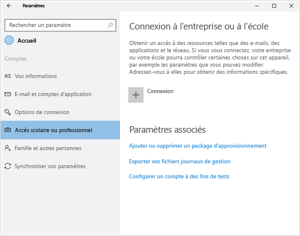
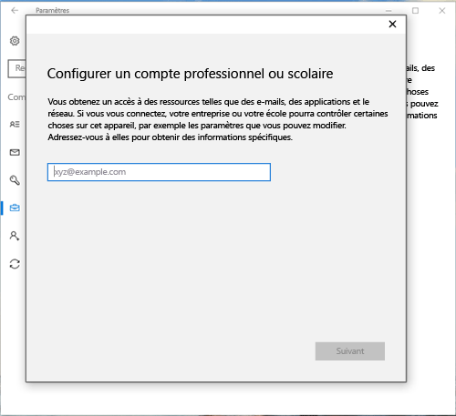
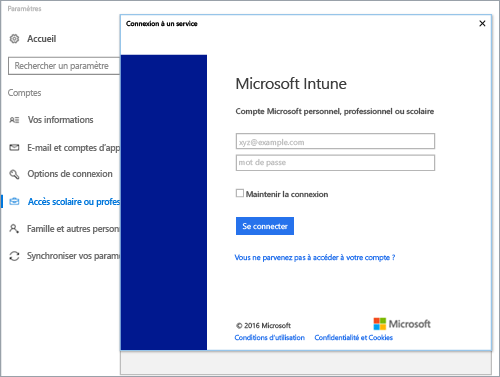
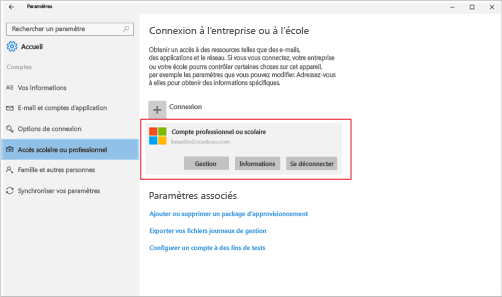
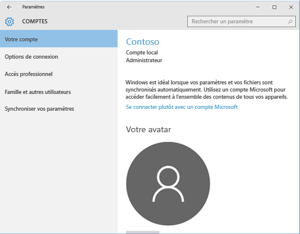
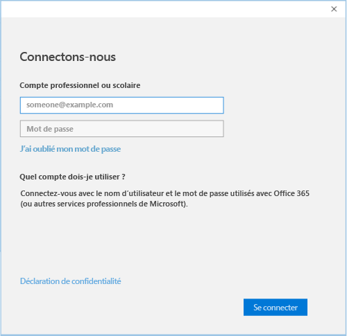

# Inscrire des appareils Windows 10 avec le portail d’entreprise Intune

Utilisez le portail d’entreprise Intune afin d’inscrire votre appareil Windows 10 à la gestion par votre organisation. Cet article explique comment inscrire des appareils avec Windows 10 version 1607 et ultérieure, et avec Windows 10 version 1511 et antérieure. Avant de commencer, [vérifiez la version installée sur votre appareil](windows-enrollment-company-portal.md#find-windows-10-version-number) de façon à suivre les étapes correctes.  

Windows 10 est pris en charge sur différents types d’appareils, notamment des postes de travail, des téléphones et des tablettes. Les étapes d’inscription sont identiques, quel que soit l’appareil que vous utilisez. Cependant, votre écran peut différer légèrement des images montrées dans cet article.  
 
> [!VIDEO https://www.youtube.com/embed/TKQxEckBHiE?rel=0]

## Inscrire un appareil Windows 10 version 1607 et ultérieure 
Ces étapes expliquent comment inscrire un appareil qui exécute Windows 10, version 1607 et ultérieure.  

1. Accédez à **Démarrer**. Si vous êtes sur un appareil Windows 10 Mobile, passez à la liste **Toutes les applications**.

2. Ouvrez l’application **Paramètres**. Si l’application n’est pas disponible dans votre liste d’applications, accédez à la barre de recherche et tapez « paramètres ».

3. Sélectionnez **Comptes** > **Accès Professionnel ou Scolaire** > **Se connecter**.  

      

4. Pour accéder à la page de connexion Intune de votre organisation, entrez votre adresse de messagerie professionnelle ou scolaire. Puis sélectionnez **Suivant**.  

     

5. Connectez-vous à Intune avec votre compte professionnel ou scolaire.  

      

    Vous verrez finalement un message indiquant que votre société ou votre école procède à l’inscription de votre appareil.

6. Si votre organisation vous oblige à configurer un code PIN pour Windows Hello, vous êtes invité à entrer un code de vérification. Entrez le code et suivez les instructions les étapes à l’écran pour créer un code PIN.  

7. À l’écran **Vous voilà prêt !** s’affiche, sélectionnez **Terminé**. Votre appareil est maintenant inscrit.  

8. Pour vérifier votre connexion, revenez à **Paramètres** > **Comptes** > **Accès professionnel ou scolaire**.  Votre compte doit maintenant figurer dans la liste.  

      

Vous ne parvenez toujours pas à accéder à votre messagerie professionnelle ou scolaire, à vos fichiers ou à d’autres données ? Découvrez comment [résoudre les problèmes liés aux comptes](troubleshoot-your-windows-10-device-windows.md#troubleshooting-steps-to-follow-if-you-see-access-work-or-school).  

## Inscrire un appareil Windows 10 version 1511 et antérieure  
Ces étapes expliquent comment inscrire un appareil qui exécute Windows 10, version 1511 et antérieure.  

1. Accédez à **Démarrer**. Si vous êtes sur un appareil Windows 10 Mobile, passez à la liste **Toutes les applications**.

2. Ouvrez l’application **Paramètres**. Si l’application n’est pas disponible dans votre liste d’applications, accédez à la barre de recherche et tapez « paramètres ».

3. Sélectionnez **Comptes** > **Votre compte**.  

      

5. Sélectionnez **Ajouter un compte professionnel ou scolaire**.  

      

6. Connectez-vous avec vos informations d'identification professionnelles ou scolaires.  

      

Vous ne parvenez toujours pas à accéder à votre messagerie professionnelle ou scolaire, à vos fichiers ou à d’autres données ? Découvrez comment [résoudre les problèmes liés aux comptes](troubleshoot-your-windows-10-device-windows.md#troubleshooting-steps-to-follow-if-you-see-your-account) lors de l’inscription.  

## Support technique pour les administrateurs informatiques   

Si vous êtes administrateur informatique et que vous rencontrez des problèmes lors de l’inscription d’appareils, consultez [Résolution des problèmes d’inscription d’appareils Windows dans Microsoft Intune](https://support.microsoft.com/help/4469913). Cet article liste les erreurs courantes, leurs causes et les étapes pour les résoudre. 

## Étapes suivantes  
Si vous avez besoin d’aide sur le portail d’entreprise ou sur l’inscription, contactez l’équipe de support technique du département informatique de votre organisation. Vous trouverez ses informations de contact sur le [site web Portail d’entreprise](https://go.microsoft.com/fwlink/?linkid=2010980). Connectez-vous au site web avec votre compte professionnel ou scolaire.  

 

