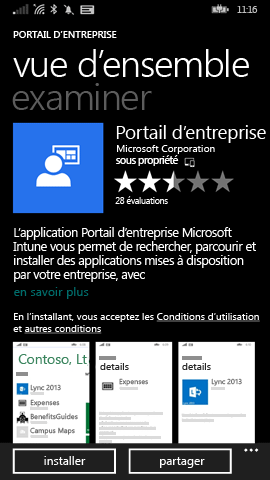
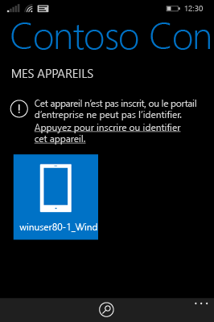
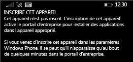
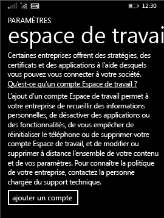

# Inscrire un appareil Windows Phone 8.1 dans Intune  

Inscrivez vos appareils pour obtenir l’accès à vos fichiers, e-mails et ressources professionnels ou scolaires. Quand vous inscrivez vos appareils, votre organisation peut sécuriser les données d’entreprise. Pour en savoir plus sur l’inscription, consultez [Que se passe-t-il si j’installe l’application Portail d’entreprise et que j’inscris mon appareil dans Intune ?](what-happens-if-you-install-the-company-portal-app-and-enroll-your-device-in-intune-windows.md) et [Liste de ce que le support technique de votre entreprise peut voir ou non sur votre appareil](what-info-can-your-company-see-when-you-enroll-your-device-in-intune.md).  

Pour inscrire votre appareil dans Intune, suivez l’ensemble d’instructions correspondant à vos autorisations ou à votre statut de compte actuel.

## Inscrire via le portail d’entreprise  
Suivez ces étapes si vous pouvez installer l’application du portail d'entreprise depuis le Microsoft Store. 

1. Appuyez sur **Démarrer** > **Boutique**.  

2. Appuyez sur **Rechercher**, puis tapez **portail d’entreprise**.  

3. Dans la liste des résultats, appuyez sur **Portail d’entreprise**.  

      

4. Appuyez sur **Portail d’entreprise** &gt; **Installer**.  

      

Inscrivez votre appareil :  

1. Sur l’appareil, ouvrez l’application **Portail d’entreprise Microsoft Intune**.  

2. Entrez vos informations d'identification. Le cas échéant, vous pouvez être invité à accepter les termes et conditions de votre entreprise.  

3. Passez à **Mes appareils**.  

4. Sélectionnez **Appuyez pour inscrire ou identifier cet appareil**.  

      

5. Appuyez sur **Inscrire cet appareil**.  

      

6. Appuyez sur **Ajouter un compte**.  

      

7. Entrez les informations supplémentaires demandées, puis appuyez sur **Se connecter** pour terminer l’inscription. Votre compte d’espace de travail doit à présent être répertorié dans la page **Paramètres** &gt; **Espace de travail**.  

      

## Inscrire via les paramètres d’application  
Suivez ces étapes si vous ne parvenez pas à accéder au Microsoft Store à partir de votre appareil Windows Phone ou si vous n’avez pas de compte Microsoft.

1. Appuyez sur **Paramètres** &gt; **Espace de travail**.  

2. Appuyez sur **ajouter un compte**, puis connectez-vous en utilisant votre compte professionnel.  

3. Entrez les informations supplémentaires demandées, puis appuyez sur **Se connecter** pour terminer l’inscription.  

4. Si vous êtes invité à installer l’application ou le hub d’entreprise, vérifiez que la case correspondante est cochée, puis appuyez sur **terminé**.  

Si le support technique de votre entreprise a configuré le portail d’entreprise pour qu’il soit installé au moment de l’inscription, il figure dans votre liste d’applications.  

Encore besoin d’aide ? Contactez le support technique de votre entreprise. Pour obtenir ses informations de contact, consultez le [site web du Portail d’entreprise](https://go.microsoft.com/fwlink/?linkid=2010980).
