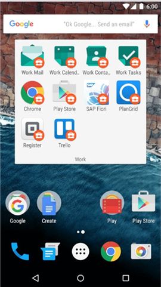

# Ce qui se passe quand vous créez un profil professionnel

Un profil professionnel est un profil que vous configurez sur votre appareil pour séparer vos e-mails, applications et données professionnels ou scolaires de vos données personnelles.

Quand vous créez un profil professionnel :

- Le support technique de votre entreprise peut gérer seulement les e-mails, les applications, les paramètres et les données professionnels sur votre appareil, et non pas vos applications ou données personnelles.

- Vous obtenez les applications professionnelles à partir du Play Store for Work. Pour obtenir les applications personnelles, vous continuez à accéder au Google Play Store que vous utilisez habituellement à cette fin. Le support technique de votre entreprise ne peut pas voir ou gérer vos applications personnelles.

- Les applications professionnelles sont séparées de vos applications personnelles, mais les unes et les autres peuvent apparaître sur votre écran d’accueil en même temps. Voici un exemple de ce que vous pouvez voir. Votre écran peut différer légèrement.

- Les icônes des applications professionnelles symbolisent un porte-documents blanc dans un cercle rouge, comme indiqué ci-dessous. Les icônes des applications personnelles ne montrent pas le porte-documents et conservent leur apparence actuelle.

    

- Votre société ou votre établissement scolaire détenant votre profil professionnel, le support technique de votre entreprise peut installer ou supprimer des applications professionnelles ou votre profil, mais pas vos applications ou données personnelles.
- Le support technique de votre entreprise ne peut pas réinitialiser ou effacer votre appareil.

Pour plus d’informations sur la création d’un profil professionnel, consultez [Créer un profil professionnel et inscrire votre appareil](create-a-work-profile-and-enroll-your-device-in-intune-android.md).

Encore besoin d’aide ? Contactez le support technique de votre entreprise. Pour obtenir ses coordonnées, consultez le [site web du Portail d’entreprise](https://go.microsoft.com/fwlink/?linkid=2010980).
