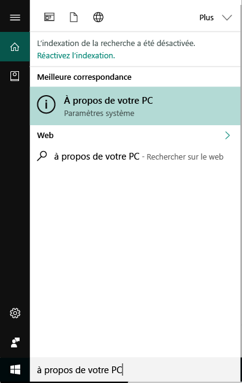
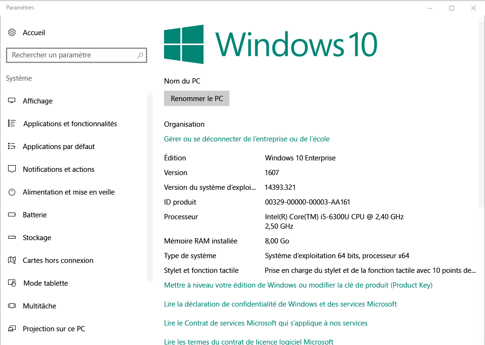

# Inscription d’un appareil Windows dans le portail d’entreprise Intune  

Inscrivez votre appareil Windows dans l’application Portail d’entreprise Intune pour obtenir un accès sécurisé aux applications, e-mails et fichiers professionnels et scolaires. Si votre organisation exige ou recommande certaines applications, comme Office ou OneDrive, vous les recevrez lors de l’inscription ou elles seront disponibles dans le portail d’entreprise après l’inscription.  

Vous pouvez inscrire des appareils Windows 10 via le site web *ou* l’application Portail d’entreprise. Si vous inscrivez un appareil avec une version antérieure de Windows, vous devez inscrire l’appareil via le site web Portail d’entreprise.  

## Installer l’application Portail d’entreprise  
L’application Portail d’entreprise est peut-être déjà installée sur votre appareil. Recherchez l’application dans votre liste __Toutes les applications__.  Si l'application Portail d'entreprise ne figure pas dans votre liste d'applications, procédez comme suit pour l'installer.  

1. Ouvrez **Microsoft Store** sur votre appareil.

2. Dans le champ **Rechercher**, tapez **Portail d’entreprise**.

3. Dans la liste des résultats, sélectionnez **Portail d’entreprise** > **Installer**.

4. Sélectionnez **Installer** ou **Gratuit**. Il n’existe aucune différence entre ces deux options ; les mots apparaissent en fonction de la façon dont votre organisation a configuré l’application.  

## Rechercher le numéro de la version de Windows 10  
Les étapes d’inscription diffèrent selon les différentes versions des appareils Windows 10. Les étapes suivantes expliquent comment trouver le numéro de version sur les postes de travail et les appareils mobiles Windows 10. Une fois que vous connaissez votre version, continuez en passant aux étapes d’inscription recommandées.  

### Appareils Windows 10 Desktop  

1. Accédez à **Démarrer**.

2. Dans la barre de recherche, tapez la phrase « À propos de votre PC ». Sélectionnez __À propos de votre PC__ dans les résultats.  

     

3. Faites défiler vers le bas jusqu’à **Spécifications de Windows** pour trouver la **Version** de Windows 10 qui est installée sur votre PC.  

     

4. Si votre version est  

    * __1607 ou version ultérieure__ : inscrivez votre appareil via [**Paramètres** > **Compte** > **Accès professionnel ou scolaire**](enroll-windows-10-device.md#enroll-windows-10-version-1607-and-later-device).   
    * __1511 ou version antérieure__ : inscrivez votre appareil via [**Paramètres** > **Compte** > **Vos comptes**](enroll-windows-10-device.md#enroll-windows-10-version-1511-and-earlier-device).  

### Appareils Windows 10 Mobile

1. Accédez à __Toutes les applications__ et sélectionnez l’application __Paramètres__.
2. Sélectionnez __Système__ > __À propos de__.
3. Sous __Informations sur l’appareil__, recherchez la __Version__.  
4. Si votre version est  

    * __1607 ou version ultérieure__ : inscrivez votre appareil via [**Paramètres** > **Accès professionnel ou scolaire**](enroll-windows-10-device.md#enroll-windows-10-version-1607-and-later-device).   
    * __1511 ou version antérieure__ : inscrivez votre appareil via [**Paramètres** > **Comptes**](enroll-windows-10-device.md#enroll-windows-10-version-1511-and-earlier-device).  

## Inscrire des appareils non-Windows 10  
Utilisez les articles suivants pour inscrire d’autres appareils Windows pris en charge via le site web Portail d’entreprise :   
* [Appareil Windows 8.1 ou Windows RT 8.1](enroll-your-W81-or-rt81-windows.md)  
* [Appareil Windows Phone 8.1](enroll-your-wp81-windows.md)    

## Support technique pour les administrateurs informatiques  
Si vous êtes administrateur informatique et que vous rencontrez des problèmes lors de l’inscription d’appareils, consultez [Résolution des problèmes d’inscription d’appareils Windows dans Microsoft Intune](https://support.microsoft.com/help/4469913). Cet article liste les erreurs courantes, leurs causes et les étapes pour les résoudre.  

## Étapes suivantes  
Maintenant que vous connaissez les appareils pris en charge et votre numéro de version de Windows 10, passez à l’article recommandé pour l’inscription.  
 
Pour plus d’informations sur la gestion des appareils, sur le portail d’entreprise, et sur la façon dont les deux sont utilisés dans les environnements scolaires et professionnels, consultez les articles suivants :  
* [Utiliser des appareils gérés pour accéder aux ressources professionnelles ou scolaires](use-managed-devices-to-get-work-done.md)  
* [Qu’est-ce qui se produit lorsque vous inscrivez votre appareil dans Intune](what-happens-if-you-install-the-company-portal-app-and-enroll-your-device-in-intune-windows.md)  
* [Quelles informations mon organisation peut-elle voir quand j’inscris mon appareil ?](what-info-can-your-company-see-when-you-enroll-your-device-in-intune.md)  

Vous avez besoin d'aide ? Contactez le support technique de votre entreprise. Pour trouver les informations de contact du département informatique de votre organisation, [accédez au site web Portail d’entreprise](https://go.microsoft.com/fwlink/?linkid=2010980).  
