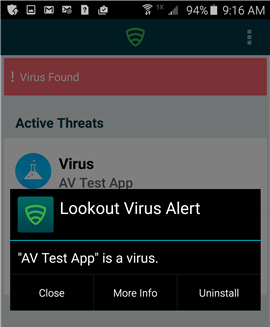

# Résoudre une menace détectée par Lookout for Work  

L’application Lookout for Work est un service Mobile Threat Defender qui identifie les menaces potentielles sur vos appareils Android. Ces menaces sont signalées à l’application Portail d’entreprise et y apparaissent comme des problèmes non résolus et non conformes. Tant que ces menaces sont présentes, vous risquez de ne pas pouvoir :

* Vous connecter à la messagerie d’entreprise.
* Vous connecter au réseau Wi-Fi d’entreprise.
* Vous connecter à SharePoint Online.
* Synchroniser des fichiers d’entreprise avec OneDrive.
* Accéder aux applications d’entreprise.

Cet article décrit comment reconnaître les alertes de menace Lookout for Work et ce que vous devez faire pour les résoudre. 

## Résoudre les menaces de sécurité ou de virus  
Récupérez l’accès aux ressources de votre entreprise quand l’application Lookout for Work détecte une menace de sécurité ou de virus.  

1. Si une menace de sécurité ou de virus est détectée, vous recevez un message similaire à celui figurant dans la capture d’écran ci-dessous. Appuyez sur le lien **portail de gestion des appareils** pour ouvrir le [site web du portail d’entreprise](https://portal.manage.microsoft.com/devices).  

    

2. Sélectionnez votre appareil.  
3. Lisez l’avertissement affiché au-dessous de votre appareil. Il vous invite à ouvrir Lookout for Work pour résoudre la menace de virus ou de sécurité. 

      

## Résoudre une menace liée à une application  

Si vous installez une application que Lookout for Work identifie comme une menace, vous recevez un message similaire à celui figurant dans la capture d’écran ci-dessous.  

  

Pour récupérer l’accès à la messagerie et aux données d’entreprise, désinstallez l’application douteuse. Tant que l’application se trouve sur votre appareil, vous ne pourrez pas accéder aux ressources de l’entreprise.    

Encore besoin d’aide ? Contactez le support technique de votre entreprise. Pour obtenir ses coordonnées, consultez le [site web du Portail d’entreprise](https://go.microsoft.com/fwlink/?linkid=2010980).  
