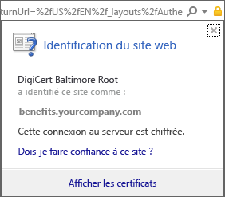
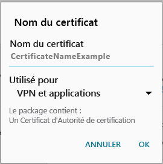

# Installer le certificat manquant requis par votre organisation  

Si votre appareil n’est pas inscrit dans Intune et qu’il manque un certificat obligatoire, vous ne pourrez pas vous connecter à l’application Portail d’entreprise. Quand vous essayez de vous connecter, le message suivant s’affiche :

Deux options vous permettent de télécharger le certificat requis et de faire en sorte que votre appareil soit inscrit. 

- Activez l’accès du navigateur dans Portail d’entreprise application.
- Identifiez le certificat manquant sur votre ordinateur professionnel ou scolaire. Puis, recherchez sur Internet pour télécharger le certificat manquant. 

Effectuez les étapes pour activer l’accès au navigateur en premier. Après cela, si vous ne parvenez toujours pas à inscrire votre appareil, suivez les étapes pour localiser le certificat sur Internet. 

## Activer l’accès du navigateur
Effectuez les étapes suivantes pour activer l’accès au navigateur. Une fois que vous avez activé l’accès, Portail d’entreprise installe le certificat approprié et poursuit l’inscription.    

1. Dans l’application Portail d’entreprise, accédez à l’angle droit et sélectionnez le menu.  
2. Sélectionnez **Paramètres**.  
3. En regard de **activer l’accès au navigateur** , sélectionnez **activer**.  
4. Dans l’écran administrateur de l’appareil, sélectionnez **activer**. 

## Identifier et télécharger le certificat manquant via la recherche Web
Procédez comme suit pour identifier et installer manuellement le certificat sur votre appareil.  

1. Ouvrez Internet Explorer sur votre PC. Si vous n’avez pas de PC utilisable pour cette action, contactez le support technique de votre entreprise. Pour obtenir les coordonnées du support technique de votre entreprise, consultez le [site web du portail d’entreprise](https://go.microsoft.com/fwlink/?linkid=2010980).

2. Accédez au site web [Portail d’entreprise](https://go.microsoft.com/fwlink/?linkid=2010980), puis connectez-vous à l’aide de vos informations d’identification professionnelles ou scolaires.

3. À l’extrême droite de la barre d’adresse du navigateur, choisissez le symbole qui ressemble à un verrou, comme illustré dans la capture d’écran suivante.

    

    Si vous ne voyez pas le symbole de verrou, arrêtez et contactez le support technique de votre entreprise. Le verrou signifie que vous êtes connecté en toute sécurité, donc ne continuez pas tant que vous ne voyez pas ce symbole.

4. Choisissez **Afficher les certificats**.

    

5. Choisissez l’onglet **Chemin d’accès de certification**, puis identifiez le certificat que vous devez obtenir à partir d’Internet. Le nom de ce certificat est affiché au même endroit que celui mis en surbrillance dans la capture d’écran précédente.

6. À l’aide d’un moteur de recherche tel que Bing ou Google, recherchez le nom du certificat manquant que vous avez identifié dans la section précédente. Le nom du certificat peut se terminer par différentes extensions, telles que « .crt » ou « .pem », etc.

7. Téléchargez le certificat racine à partir du site web.

8. Une fois le certificat téléchargé, faites défiler l’écran de votre appareil de bas en haut pour accéder à vos notifications, puis cliquez sur le nom du certificat dans la liste des notifications.

4. Dans la boîte de dialogue **Name the certificate** (Nommer le certificat) illustrée dans la capture d’écran suivante, acceptez le nom du certificat par défaut.

5. Vérifiez que **Credential Use** (Utilisation des informations d’identification) a la valeur **Used for VPN and apps** (Utilisé pour le VPN et les applications), puis appuyez sur **OK**.

    

6. Fermez l’application Portail d’entreprise.

7. Rouvrez l’application Portail d’entreprise. Vous devriez pouvoir vous connecter à l’application Portail d’entreprise. Si vous avez besoin d’aide, contactez le support technique de votre entreprise.

Si un message « Certificat manquant » semblable à celui indiqué précédemment s’affiche alors que vous avez déjà suivi la procédure, il manque probablement un autre certificat. Vous devez demander au support technique de votre entreprise de vous aider à l’installer. Contactez le support technique de votre entreprise pour obtenir de l’aide sur les informations de contact disponibles sur le [site web du portail d’entreprise](https://go.microsoft.com/fwlink/?linkid=2010980).

## Étapes suivantes  

Encore besoin d’aide ? Contactez le support technique de votre entreprise. Pour obtenir ses coordonnées, consultez le [site web du Portail d’entreprise](https://go.microsoft.com/fwlink/?linkid=2010980).  
